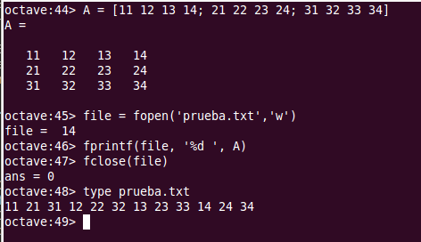
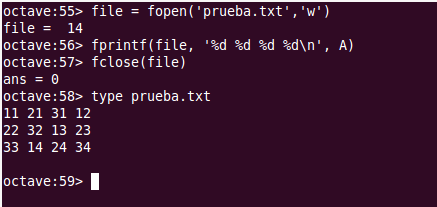

Lectura y escritura de ficheros de texto
========================================
.. role:: raw-html(raw)
   :format: html

.. contents::
	:depth: 2

.. toctree::

	ejerciciosficheros.rst

.. Note:: La documentación de Octave y de Matlab correspondiente a este capítulo se puede encontrar en los siguientes enlaces: 
	
	- **Octave**: :raw-html:`<a href='http://www.gnu.org/software/octave/doc/interpreter/Opening-and-Closing-Files.html' target='_blank'>http://www.gnu.org/software/octave/doc/interpreter/Opening-and-Closing-Files.html</a>`

	- **Matlab**: :raw-html:`<a href='http://es.mathworks.com/help/matlab/low-level-file-i-o.html' target='_blank'>http://es.mathworks.com/help/matlab/low-level-file-i-o.html</a>`

Comandos utilitarios trabajando con ficheros
--------------------------------------------
Cuando estamos trabajando con ficheros de texto hay varios comandos de *Octave* que conviene conocer.

El comando **type** permite mostrar el contenido de un fichero de texto en la consola. La forma de utilizar el comando es la siguiente: **type filename**, siendo *filename* el nombre de un fichero existente. Si el nombre del fichero incluye su ruta de directorio, se buscará el fichero en la ruta especificada. Si solo se incluye el nombre del fichero, se buscará en el directorio de trabajo.

El directorio de trabajo en el que estamos posicionados se puede consultar con **pwd()**, que muestra en pantalla la ruta del directorio de trabajo donde estamos posicionados.

El contenido del directorio de trabajo se puede mostrar mediante el comando **dir**, al estilo windows, o mediante el comando **ls**, al estilo linux. Los dos comando admiten una *mascara* que permite especificar el tipo de fichero buscados. Por ejemplo podríamos utilizar *dir *.m* para mostrar un listado de los ficheros con extensión *.m*. En  la máscara, el arterisco hace la función de comodín. Podríamos leer el comando anterior como: *'dir lo-que-sea punto m'*. 

También podemos cambiar el directorio de trabajo desde la consola de *Octave*. Para ello se utiliza el comando **cd**, '*change directory*', que admite un parámetro a continuación para especificar la ruta a la que se quiere acceder. Hay un atajo que hay que conocer. Si tecleamos **cd ..**, *cd punto punto*, nos moveremos al directorio padre del directorio en el que estemos posicionados. Para acceder a un determinado directorio utilizaremos: **cd dirname**, donde *dirname* es el nombre o la ruta completa del directorio en el que queremos posicionarnos.

Los comandos anteriores admiten ser utilizados en forma de función.

Los comandos **load** y **save**
-------------------------------------
Podemos guardar variables en ficheros de texto mediante el comando *Octave* **save**. Las variables guardadas las podremos recuperar luego mediante el comando **load**. El comando *save* se puede utilizar de distintas maneras:

- **save filename**: Guarda todas las variables del *workspace* en el fichero *filename*, donde *filename* es el nombre del fichero y opcionalmente su ruta completa.

- **save filename v1 v2**: Se pueden especificar qué variables concretas queremos guardar en el fichero. En este ejemplo, solo se guardarán el el fichero *filename* las variables de nombre *v1* y *v2*.

- **save options filename v1 v2**: donde *options* son una o más opciones separadas por espacio. Las opciones nos permiten especificar, por ejemplo, que se guarden los ficheros en distintos formatos binarios o que se guarden los datos en formato comprimido *zip*. 

La forma de operar se puede ver en el siguiente ejemplo, donde primero definimos una matriz y a continuación la guardamos en un fichero 'matriz.txt'. Por último se muestra el contenido del fichero mediante *type()*:

La función **fopen()**
----------------------

Para poder realizar operaciones de lectura y/o escritura en los ficheros de texto es necesario primero abrir el fichero con **fopen()**. Una vez abierto el fichero, se procede a realizar las distintas operaciones de lectura y/o de escritura en el mismo. Cuando se termina de operar con el fichero hay que cerrarlo con la funcion **fclose()**. 

El procedimiento habitual para leer datos de un fichero se resume en el siguiente esquema:

.. code-block:: octave

	file = fopen('mifichero.txt', 'r');

	% Operaciones de lectura del fichero

	fclose(fid);

Ĺa función **fopen()** tiene la siguiente signatura:

- **file = fopen(filename, permission)** Abre el fichero de nombre *filename* con el tipo de acceso especificado por *permission*. Devuelve *file*,  que es un número, un *puntero*, que identifica al fichero en ulteriores operaciones de lectura escritura. Si se producen errores al intentar abrir el fichero, la función *fopen()* devuelve *-1*. El puntero será un número mayor o igual a *3*. Los parametros son los siguientes:

	- *filename*: cadena de texto con el nombre del fichero que se quiere abrir. Si incluye la ruta del fichero se utilizará, si no se buscará o creara el fichero en el directorio de trabajo.

	- *permission*: especifica el modo de apertura del fichero. Lo habitual es abrir el fichero para escribir en él o para leer de él, si bien es también posible abrir el fichero en modo *lectura y escritura*. En los modos de escritura es posible añadir texto a un fichero existente o bien crear uno nuevo para la operación, sobreescribiendo el existente si lo hubiera. *permission* es una cadena de texto que puede tener los siguientes valores:

		- 'r': Abre el fichero para lectura. Es el modo por defecto, si se utiliza la función *fopen()* sin el argumento *permission*
		- 'r+': Abre el fichero en modo *lectura-escritura*
		- 'w': Abre o crea un nuevo fichero en modo *escritura*. Si existe se sobreescribe
		- 'w+': Abre o crea un fichero para *lectura-escritura*. Si existe, se sobreescribe
		- 'a': Abre o crea un nuevo fichero para *escritura*. Si existe el fichero, añade al final del mismo.
		- 'a+': Abre o crea un nuevo fichero para *lectura-escritura*. Si existe, se añade al final del mismo.

.. Note:: Hay dos modos más de apertura de ficheros: 'A' y 'W' que no realizan el *flush* automático de los datos.

.. Note:: La función *fopen()* admite un tercer y cuarto parámetros que permiten especificar el orden de lectura escritura de los bytes (Big-endian, Little-endian) y la codificación de caracteres del fichero (UTF-8, ISO-8859-1,...). 

.. Note:: **fids = fopen('All')**: Devuelve un vector con los punteros a TODOS los ficheros abiertos que haya.

La función **fclose()**
-----------------------

Sirve para cerrar los ficheros cuando se ha terminado de trabajar con ellos. 

- **fclose(file)**: Cierra el fichero *file*. Devuelve *0* si pudo cerrar el fichero o *-1* si hay errores.

- **fclose('All')**: Cierra todos los ficheros que haya abiertos. Devuelve *0* si pudieron cerrar los ficheros o *-1* si hay errores.

Lectura de ficheros línea a línea
---------------------------------
Una vez abierto el fichero para lectura podemos ir leyendo una línea cada vez, que recibiremos como una cadena de texto, con o sin carácter fin de línea, según la función de lectura utilizada:

- **line = fgets(file)**: Lee una línea del fichero *file*, incluyendo el caracter de fin de línea, y la devuelve en forma de cadena de texto.

- **line = fgets(file, nchar)**: Lee al menos *nchar* caracteres de la siguiente línea del fichero *file*. (Si se alcanza el final de línea o el final del fichero devuelve lo que haya leído hasta ahí).

- **line = fgetl(file)**: Lee la siguiente línea del fichero *file*, sin incluir el caracter fin de línea, y la devuelve como una cadena de caracteres.

Lectura de datos formateados
----------------------------
Octave ofrece la posibilidad de leee los datos contenidos en el fichero, uno a uno, y devolverlos en el formato seleccionado, pudiendo de esta manera leer , no solo cadenas de texto, sino también números enteros o doubles.

La función para leer datos formateados es **fscanf()**. La función *fscanf()* admite varias signaturas. Una forma habitual de utilizar la función es la siguiente:

**fscanf()**

Escritura de datos formateados
------------------------------

En el ejemplo siguiente creamos una matriz *A* de tres filas y cuatro columnas. A continuación la escribimos en un fichero con una simple indicación de formato numérico. Cuando hacemos *type* al fichero recién creado podemos ver la forma en que *Octave* ejecuta la función *fprintf()*. 

Como vemos la sentencia *fprintf(file, '%d ', A)* escribe todos los elementos de la matriz A en el fichero, utilizando el formato indicado: *numero entero más espacio*. Hay que fijarse en el orden en que Octave coge los elementos de A para escribirlos en el fichero. Vemos que coge los elementos de la matriz por columnas, esto es, primero el *A(1,1)*, a continuación el *A(2,1)*, y así hasta agotar la primera columna, leyendo a continuación las siguientes columnas de la misma manera hasta agotar la matriz. 

Lo que hace Octave es leer las matrices en el orden el que las tiene guardadas en memoria, y *Octave* guarda las matrices en memoria por columnas.

Si en lugar del formato especificado en el ejemplo anterior, ejecutamos la sentencia *fprintf(file, '%d %d %d %d \\n', A)*, en la que decimos a *Octave* que cada cuatro números inserte un carácter fin de línea *'\\n'*, *Octave* escribirá tres filas y cuatro columnas, pero no en el orden de filas y columnas en el que tenemos definida la matriz:

Una vez más *Octave* rellena el formato indicado cogiendo los elementos de la matriz por columnas.

