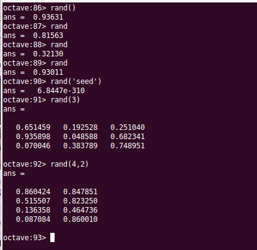
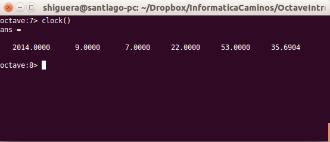

Funciones predefinidas en Octave
================================
.. role:: raw-html(raw)
   :format: html

*Octave* tiene una extensa librería de funciones predefinidas que abarcan numerosos campos de la ciencia matemática.

Funciones para cadenas de caracteres
------------------------------------

.. Note:: La documentación de Octave y Matlab para manejar cadenas de caracteres se puede encontrar en:

   - **Octave**: :raw-html:`<a href='http://www.gnu.org/software/octave/doc/interpreter/Manipulating-Strings.html' target='_blank'>http://www.gnu.org/software/octave/doc/interpreter/Manipulating-Strings.html</a>`

   - **Matlab**: :raw-html:`<a href='http://es.mathworks.com/help/matlab/characters-and-strings.html' target='_blank'>http://es.mathworks.com/help/matlab/characters-and-strings.html</a>`

- **strrep** : Reemplaza una subcadena dentro de una cadena

.. code-block:: octave

   cad = '3,78'
   newcad = strrep(cad, ',','.');
   % result : newcad = 3.78

--**strtrim(cad)**: Quita los caracteres *espacio* del inicio y final de una cadena

- **C = strsplit(str, delimiter)**: Devuelve un *CellArray* con las subcadenas que resultan de dividir la cadena original *str* con el separador *delimiter*. 

.. code-block:: octave

   cad = '3,78'
   c = strsplit(cad, ',');
   pentera = str2num(c{1}) % result 3 double
   pdec = str2num(c{2}) % result 78 double

.. Note:: Recordar que para extraer elementos de un *CellArray* se utilizan llaves, no paréntesis. La función *size()* con *CellArrays* funciona igual que con matrices normales.

- **str2num(cad)**: Convierte en número double la cadena *cad*   

La función *rand()*
-------------------

La función **rand()** se utiliza para generar numeros pseudoaleatorios. Se pueden generar scalares o matrices de números pseudoaleatorios. Si llamamos a la función sin argumentos  nos devolverá un numeros pseudoaleatorios uniformemente distribuidos entre 0 y 1. 

Si pasamos un número entero *n* como parámetro, la función nos devolverá una matriz cuadrada de dimensión *n* de numeros pseudoaleatorios comprendidos entre 0 y 1. Si le pasamos dos números enteros *m* y *n* la matriz resultante tendrá *m* filas y *n* columnas.

El numero que está utilizando *Octave* como *semilla* generadora de los números pseudoaleatorios se puede ver con **rand('seed')**. También podemos modificar la *semilla* con **rand('seed', x)**, donde *x* es la nueva *semilla* que queremos utilizar.

Los números generados por *rand()* son doubles comprendidos entre *0* y *1*. Si queremos generar números comprendidos en un determinado intervalo debemos operar los números obtenidos de *rand()* para adaptarlos al intervalo buscado:

.. code-block :: octave
   
   M = 1
   rand() + M
   % El resultado estará comprendido entre M y M+1 (en este caso entre 1 y 2)
   %
   M = 10
   rand() * M
   % El resultado estará comprendido entre 0 y M
   %
   A = 10
   B = 20
   A + (B-A)*rand()
   % El resultado estará entre A y B

Para generar numeros enteros en un determinado intervalo se puede utilizar la función **randi()**:

.. code-block:: octave

   randi(10)
   % Genera un número entero entre 1 y 10

También se pueden conseguir enteros mediante la función *rand()*:

.. code-block:: octave

   A = 10
   B = 20
   round(A + (B-A)*rand())
   % El resultado será un entero (double con parte decimal cero) entre A y B
   int32(round(A + (B-A)*rand())) 
   % El resultado será un entero int32 entre A y B
   

Utilidades para medir el tiempo
-------------------------------

La función **clock()** nos devolverá un vector con el año, mes, día, hora, minutos y segundos:

Las función **date()** nos devuelve la fecha como una cadena de texto.  

La función **time()** nos devuelve el número de segundos transcurridos desde las 00:00 horas UTC del día 1 de enero de 1970.

La función **etime()** (*elapsed time*) nos devolverá el tiempo transcurrido entre dos fechas:

.. code-block:: octave

	t0 = clock();
	# unas cuantas computaciones más tarde...
	tiempo_transcurrido = etime(clock(), t0);

La función **is_leap_year()** nos devolverá *1* (*verdadero*) si el año pasado como argumento es bisiesto.

