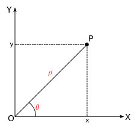
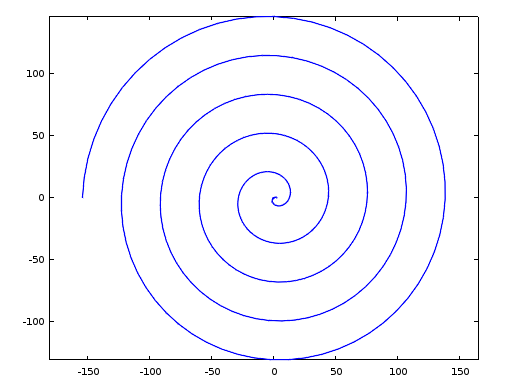
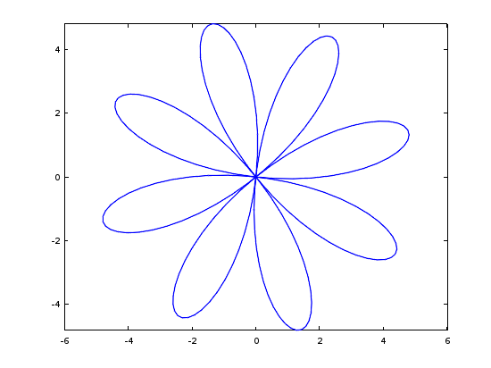
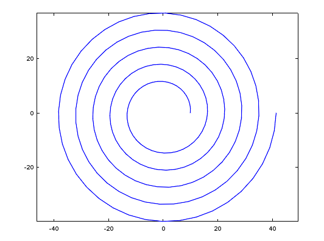
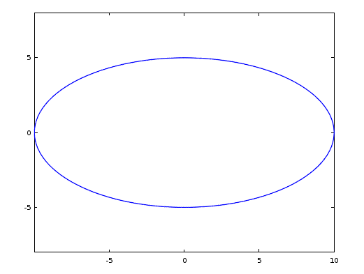
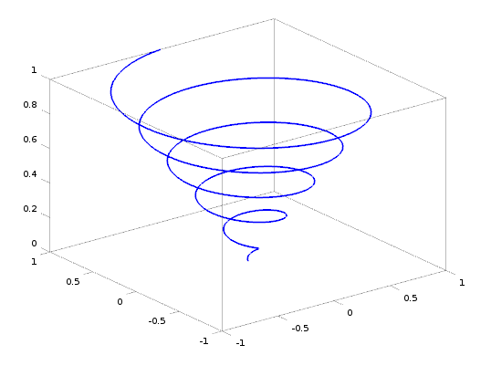
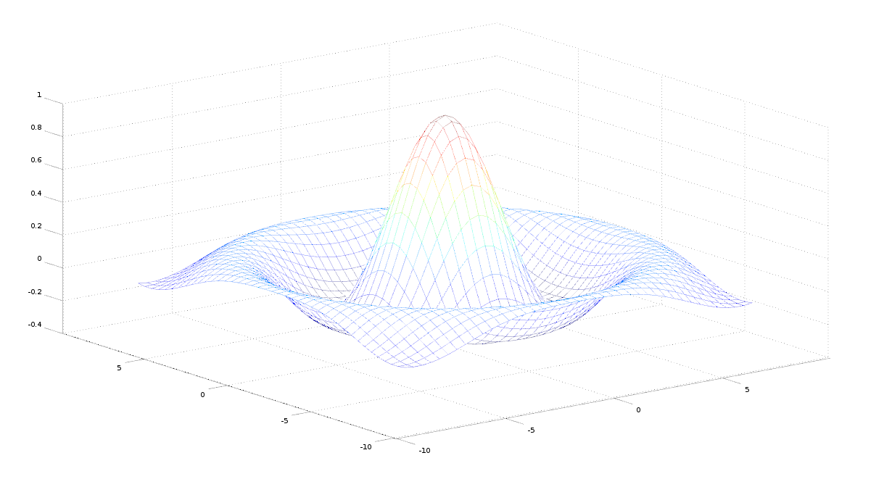
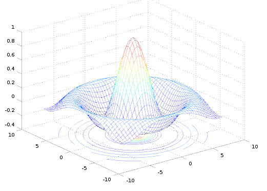
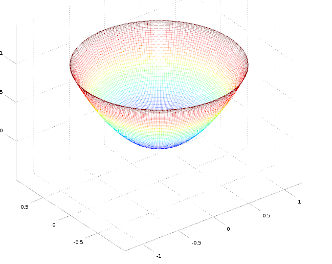

Gráficos con Octave
===================
.. contents::
   :depth: 2
   
.. toctree::
   
   ej_graficos.rst

Gráficos de curvas en coordenadas polares
-----------------------------------------

En coordenadas polares, un punto :math:`P` del plano queda definido mediante el valor :math:`\rho` de la distancia desde el punto :math:`P` al origen de coordenadas y el valor del ángulo :math:`\theta` que va desde el eje :math:`x`, en sentido antihorario, hasta la línea que une el origen de coordenadas con el punto :math:`P` (ver figura).

Se le llama ecuación polar a la ecuación que define una curva expresada en coordenadas polares. En muchos casos se puede especificar tal ecuación definiendo :math:`\rho` como una función de :math:`\theta`. La curva resultante consiste en una serie de puntos en la forma :math:`(\rho(\theta), \theta)`. Cuando una función está expresada en coordenadas polares, al origen de coordenadas se le denomina también **polo**.

.. math::

   \rho = \rho(\theta)

Para transformar las coordenadas polares a coordenadas cartesianas hay que aplicar las siguientes ecuaciones:

.. math::
   
   x = \rho \, cos(\theta)\\
   y = \rho \, sin(\theta)

Vamos a explicar cómo representar gráficamente con *Octave* una función expresada en coordenadas polares. Utilizaremos para ello la siguiente función: 

.. math::

   \rho(\theta) = 3 - 5 \, \theta \;\;\;\; \theta \in [0, 10 \, \theta]

Lo primero es discretizar el parámetro :math:`\theta`. A continuación se obtiene el vector de valores del radio :math:`\rho`. Una vez que tenemos los dos vectores con los valores de :math:`\rho` y :math:`\theta` podemos obtener los vectores con los valores de :math:`x` e :math:`y`, haciendo la transformación a coordenadas cartesianas. Finálmente utilizaremos la función *plot()* con los valores de :math:`x` e :math:`y` obtenidos. El código *Octave* es el siguiente:

.. code-block:: octave

   % Discretizamos ro y theta
   theta = linspace(0, 10*pi, 300);
   ro = 3 - 5 .* (theta);

   % Transformamos a cartesianas
   x = ro .* cos(theta);
   y = ro .* sin(theta);

   % Ploteamos
   plot(x,y)
   axis equal

Algunos ejemplos de funciones en coordenadas polares son:

**Circunferencia**: la expresión general de una circunferencia con centro en el punto :math:`(\rho_0, \theta_0)` y radio :math:`a` es:

.. math::

   \rho^2 + 2 \rho \, \rho_0 \, cos(\theta - \theta_0) + \rho_0^2 = a^2

Cuando la circunferencia tiene centro en el origen de coordenadas, la expresión se simplifica:

.. math::

   \rho( \theta) = a 

**Rosa polar**: es una expresión matemática con forma de flor. Su expresión es:

.. math::

   \rho(\theta) = a \, cos(k \, \theta + \theta_0)

donde :math:`\theta_0` es cualquier valor constante, incluido el cero. Si :math:`k` es un valor entero, si  es impar, la flor tendrá  :math:`k` pétalos y si :math:`k` es par, la flor tendrá :math:`2k` pétalos. Si :math:`k` es racional pero no entero, la gráfica es similar a una rosa pero con los pétalos solapados. Nótese que estas ecuaciones nunca definen una rosa con 2, 6, 10, 14, etc. pétalos. La variable a representa la longitud de los pétalos de la rosa.

**Espiral de Arquímedes**: La espiral de Arquímedes es una famosa espiral descubierta por Arquímedes, la cual puede expresarse también como una ecuación polar simple. Se representa con la ecuación:

.. math::

   \rho(\theta) = a + b \, \theta 

Un cambio en el parámetro :math:`a` producirá un giro en la espiral, mientras que :math:`b` controla la distancia entre los brazos, la cual es constante para una espiral dada. La espiral de Arquímedes tiene dos brazos, uno para :math:`\theta > 0` y otro para :math:`\theta < 0`. Los dos brazos están conectados en el polo. La imagen especular de un brazo sobre el eje vertical produce el otro brazo. Esta curva fue una de las primeras curvas, después de las secciones cónicas, en ser descritas en tratados matemáticos. Además es el principal ejemplo de curva que puede representarse de forma más fácil con una ecuación polar.

**Elipse**: la expresión polar de una elipse centrada en el origen de coordenadas y de semiejes :math:`a` y :math:`b` es:

.. math::

   \rho(\theta) = \frac{1}{\sqrt{\frac{cos^2(\theta)}{a^2} + \frac{sin^2(\theta)}{b^2}}} \;\;\; \theta \in [0, 2 \, \pi]  

Se define la excentricidad :math:`e` de una elipse mediante la siguiente expresión:

.. math::

   e = \sqrt{1 - \frac{b^2}{a^2}}

La ecuación polar de la elipse en función de su excentricidad queda de la siguiente manera:

.. math::

   \rho(\theta) = \frac{b}{\sqrt{1 - e^2 \, cos^2(\theta)}}

La función *plot3()*
--------------------

- **plot3()**: La función *plot3()* dibuja curvas en tres dimensiones, o ternas de valores arbitrarios sin necesidad de que formen una superficie. Por ejemplo, el código siguiente dibuja una espiral en tres dimensiones:

.. code-block:: octave

	t = 0:0.1:10*pi;
	r = linspace (0, 1, length(t));
	z = linspace (0, 1, length(t));
	plot3 (r.*sin(t), r.*cos(t), z, 'linewidth',2);

- **view(az, el)**: Situa el punto de vista en el azimut *az* y la elevación *el*. Haciendo *view(2)* o *view(3)* establece los valores por defecto para dos y tres dimensiones.

La función *mesh()*
-------------------

La funcion *mesh()* dibuja un gráfico de malla en la forma *Z=f(X,Y)*, tomando la *Z* como elevación y haciendo el color del mallado proporcional al valor de *Z*. Si *Z* es una matriz cuyas dimensiones son *[m, n]*. El vector de las coordenadas *x* tendrá que tener *m* elementos, y el vector de las componentes *y* tendrá *n* elementos.

Hay varias formas de llamar a la función *mesh()*: 

- **mesh(Z)**: dibuja el gráfico de malla 3D correspondiente a *Z=Z(x,y)* haciendo *x=1:m* e *y=1:n* con *[m, n] = size(Z)*. El color es proporcional al valor de *Z*.

- **mesh(X, Y, Z)**: dibuja el gráfico de malla 3D con el color determinado por el valor de Z. Si *X* e *Y* son vectores las dimensiones tienen que cumplir: *m=length(X)*, *n=length(y)* y *[m, n]=size(Z)*. En este caso, los puntos de la superfcie serán *(X(j), Y(i), Z(i,j))*. Sy *X, Y, Z* son matrices, sus dimensiones serán iguales. En este caso los puntos del mallado serán: *(X(i,j), Y(i,j), Z(i,j))*  

- **mesgrid(x,y)**: Dados dos vectores de coordenadas *x* e *y*, la función *meshgrid()* devuelve una pareja de matrices *Mx*, *My* que se corresponden con la red de puntos de intersección de las dos series *x* e *y*. Estas matrices se pueden pasar directamente a la función *mesh()* y también se pueden utilizar para calcular los valores de *Z* si conocemos su expresión en la forma *Z=f(X,Y)*.

Si mallamos los vectores *x=[0 1 2 3]* e *y=[0 1 2 3]* con la función *[xx, yy]=meshgrid(x,y)*, el resultado será el siguiente:

.. code-block:: octave

   xx = 
         0 1 2 3
         0 1 2 3
         0 1 2 3 
         0 1 2 3
   yy =
         0 0 0 0
         1 1 1 1
         2 2 2 2 
         3 3 3 3

Por ejemplo:

.. code-block:: octave

   tx = linspace (-8, 8, 41)';
   ty = linspace (-8, 8, 41)';
   [xx, yy] = meshgrid (tx, ty);
   r = sqrt (xx .^ 2 + yy .^ 2) + eps;
   tz = sin (r) ./ r;
   mesh (tx, ty, tz);

Produce el gráfico del conocido *sombrero* que se ve en la figura:

- **meshc()**: Es similar a *mesh()* pero dibuja además las curvas de nivel sobre el plano *x-y*: El resultado se puede ver en la siguiente figura:

Para representar una superficie expresada en ecuaciones paramétricas se procede de la siguiente forma. Supongamos que las ecuaciones de la superficie expresada en función de dos parámetros son las siguientes:

.. math::

   x = f_1(\theta, \phi)

   y = f_2(\theta, \phi)
   
   z = f_3(\theta, \phi)

Generaremos unos rangos para el valor de cada parámetro y utilizaremos a continuación la función *meshgrid()* para generar las matrices :math:`\Theta, \Pi` con los mallados de valores de los parámetros. A continuación podemos calcular las matrices :math:`X, Y, Z` que servirán para pasarle a la función *mesh()*. 

Veamos un ejemplo. Sea el paraboloide elíptico definido por las siguientes ecuaciones:

.. math::

   x(t, u) = a cos(t) cos(u)
   
   y(t, u) = b cos(t) sin(u)
   
   z(t, u) = (cos(t))^2

Se pide representarlo para :math:`a=1, b=1, 0 < t < 2 \pi, 0< u < 2 \pi`

.. code-block

   t = linspace(0,2*pi,100);
   u = linspace(0,2*pi,100);
   [tt, uu] = meshgrid(t, u);

   x = a * cos(tt) .* cos(uu);
   y = b * cos(tt) .* sin(uu);
   z = (cos(tt)).^ 2;

   mesh(x,y,z);

El resultado se puede ver en la siguiente figura:

