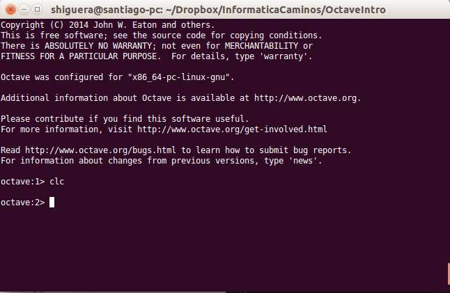

.. intro.rst 

Primeros pasos con Octave
=========================

.. contents::

.. toctree::
   	tiposdatos.rst
   	operadores.rst

Arranque de la consola de Octave
--------------------------------

Partimos de un ordenador con Octave instalado. Abriremos un terminal para poder ejecutar instrucciones del sistema operativo. En *Linux* simplemente hay que teclear '*octave*', en *Windows* el programa que tenemos que ejecutar para abrir la consola de Octave es un programa llamado *octave.exe* y que está en el directorio *'bin'* de la instalación de Octave. Si todo ha ido bien, nos aparecerá la consola de *Octave* con el *prompt* indicando algo parecido a *octave:1>*.

Para salir de la consola de Octave hay que teclear '**exit**' o '**quit**'

Cálculos elementales
--------------------

Octave se puede utilizar como una calculadora. Se dispone de las operaciones aritméticas suma, resta, multiplicación, división y exponenciación. Pruebe a teclear las siguientes operaciones en la consola de Octave:

.. code-block:: octave

	1+1
	2-1
	2*3.5
	3.0/2.0
	2^5

Tras cada  operación hay que pulsar la tecla *intro*. La consola nos mostrará la palabra *ans*, el signo igual y el resultado de la operación. La palabra *ans* quiere decir *answer*, respuesta.

Octave dispone de funciones para calcular raices cuadradas, logaritmos naturales, logaritmos decimales y funciones trigonométricas. Pruebe las siguientes operaciones en la consola de Octave:

.. code-block:: octave

	sqrt(25)
	log(10)
	log10(10)
	sin(90*pi/180)
	cos(0)
	tan(45*pi/180)
	asin(1)*180/pi
	acos(0)
	atan(-1)*180/pi

Observamos un par de cosas en las expresiones anteriores:

* La utilización de la constante predefinida *pi*. Octave tiene varias constantes con valores predefinidos, una de ellas es el número *pi=3.14...*.
* Las funciones trigonométricas trabajan con ángulos en radianes.

Podemos calcular exponenciales del número :math:`e`, por ejemplo, la ecuación de *Euler*:

.. math:: e^{i\pi} + 1 = 0

la podríamos comprobar tecleando algo así:

.. code-block:: octave

	exp(pi*i)+1

Vemos que Octave entiende la variable *i* como el número complejo :math:`i=\sqrt{-1}`. Podemos ver algunas de las variables que tiene predefinidas:

.. code-block:: octave

	e
	i
	j
	pi
	ans

Cada vez que hacemos un cálculo, el resultado se guarda en una variable llamada *ans* que podemos utilizar en el siguiente cálculo.

Asignación de variables
-----------------------

Podemos almacenar valores en memoria mediante la asignación de dichos valores a *nombres válidos* de variables. El símbolo utilizado para la asignación es el símbolo **igual '='**. 

En el ejemplo siguiente se asigna valor a las variables *x* e *y*. Estos valores quedan almacenados en la memoria de *Octave* y se pueden utilizar en operaciones posteriores utilizando en las expresiones el nombre de variable elegido. Se puede reasignar el valor de una variable en cualquier momento. El valor en memoria será el último asignado a la variable.

.. code-block:: octave

	x = 2.5
	y = 3
	x+y
	% El resultado será: ans = 5.5
	x = 4
	x+y
	% El resultado será: ans = 7

Vemos que el esquema de la *instrucción de asignación en *Octave* es situar el nombre de variable, a continuación el símbolo igual y a la derecha del símbolo igual el valor que queremos asignar a la variable. 

A la derecha del símbolo igual puede aparecer un valor numérico tecleado explicitamente o cualquier expresión válida de *Octave*. En el siguiente ejemplo se asignan distintos valores a variables:

.. code-block:: octave

	x = pi/2;
	y = sin(x)
	% El resultado será: y = 1

.. Note:: La variable predefinida **ans** de *Octave* guarda el resultado de la última operación realizada en la consola de *Octave*, siempre que esa operación no sea de asignación. Si realizamos una asignación, el valor de la variable *ans* no varía.

.. Note:: Si al hacer una asignación no queremos que muestre el resultado de la asignación en consola tenemos que finalizar la sentencia con **punto y coma ';'**.

Nombres de variables
--------------------

Los nombres de variables pueden contener letras, números y caracteres underscore (guión bajo), pero el primer carácter tiene que ser letra.

.. warning:: No hay que utilizar como nombres de variables los nombres de variables predefinidas, funciones o comandos de *Octave*.

.. Note:: Las letras que se pueden utilizar en los nombres de variables son las del alfabeto inglés. Los caracteres locales, (ñ, letras acentuadas), no se deben utilizar en el nombre de variables o funciones.

Ejemplos de nombres válidos de variables:

.. code-block:: octave

	x
	x2
	XX_2
	ultimoValor
	n_factorial

Ejemplos de nombres no válidos de variables:
	
.. code-block:: octave

	6x
	end
	n!

El número máximo de caracteres que puede tener el nombre de una variable se puede consultar con la función **namelengthmax()**: 

.. code-block:: octave

	namelengthmax()
	% El resultado en mi consola: ans = 63

.. Note:: Los nombres que dan una idea de para qué sirven las variables hacen que la legibilidad del código fuente de los programas mejore mucho. Es más facil de seguir y comprender un programa, (un tercero o el mismo programador al cabo de unas semanas o meses), cuando los nombres de variables y funciones se eligen adecuadamente. Por ejemplo, la variable *numFilas* nos dice más que la variable *n*, y puede ser de gran ayuda para *seguir* el hilo del programa en una serie de bucles y sentencias *if* anidadas. Un criterio habitual es denominar a una variable con más de una palabra, poniendo la inicial de la primera palabra en minúsculas y las iniciales del resto de palabras en mayúsculas. Así podremos utilizar nombres de variables como *contadorVehiculos* o *ultimaFila*.

Variables predefinidas en Octave
--------------------------------

