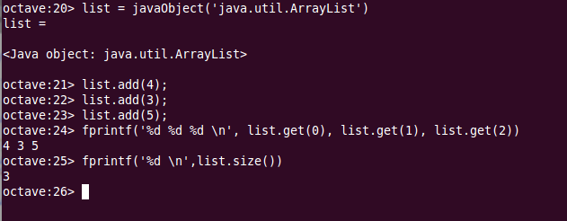

.. java.rst

Utilización de clases java desde Octave
========================================

.. Note:: Podemos acceder e interactuar con clases java desde *Octave*. Necesitaremos tener instalado el paquete *java*. Podemos comprobar si está instalado haciendo un *help javaObject* desde la consola de *Octave*. Si encuentra el *help* tendremos instalado el paquete. En caso contrario, habra que instalarlo siguiendo las instrucciones de la sección :ref:`packages`

El paquete *java* nos proporciona una API con varios métodos que podemos utilizar para crear objetos de clases *java* y acceder a sus propiedades y métodos.

Podemos instanciar un objeto de una clase *java* utilizando el método *javaObject()*, que admite como primer parámetro el nombre cualificado de la clase a la que pertenece el objeto a instanciar. El método *javaObject()* admite como parámetros adicionales los que queramos pasar al constructor de la clase. 

En el siguiente ejemplo creamos un objeto *java.util.ArrayList* al que añadimos varios números utilizando su método *add()*. A continuación accedemos al contenido del *ArrayList* con el método *get()* de la clase *java* utilizado desde dentro de la función *fprintf()* de *Octave*. Por último imprimimos el tamaño del *ArrayList* utilizando su método *size()*:

.. code-block:: octave

	list = javaObject('java.util.ArrayList')
	
	list.add(4);
	list.add(3);
	list.add(5);

	fprintf('%d %d %d \n', 
		list.get(0), list.get(1), list.get(2))

	fprintf('%d \n', l.size());

La salida en pantalla la podemos ver en la siguiente imagen:

Podemos observar la manera de acceder a los métodos del objeto *java* creado mediante el código *objeto.punto.método* habitual en *java*.

* javaclasspath()
* javaaddpath()
* javarmpath()
