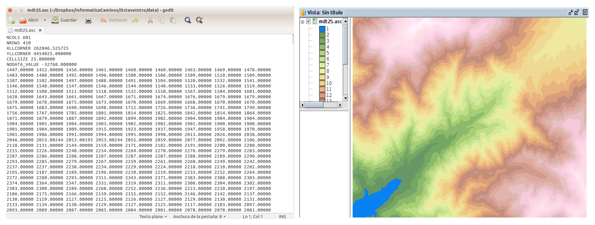

Modelos Digitales de Elevaciones
================================

Introducción
------------

Actualmente los Modelos Digitales de Elevaciones, **MDE**, sustituyen a los antiguos mapas de curvas de nivel. Consiste en dividir el terreno mediante una cuadrícula rectángular y asignar una cota a cada rectángulo resultante de la división. Esto permite representar el *MDE* mediante una matriz. Un formato habitual para este tipo de *mapas* es el formato *ESRI ASC*. Consiste en un fichero de texto en el que se guardan los valores de las alturas en formato coma flotante junto con unas lineas al principio que indican el número de filas y columnas del *MDE*, las coordenadas de la esquina inferior izquierda del mapa, (*Lower Left Corner*), el tamaño en metros del lado de los rectángulos de la rejilla, (*paso de malla*), y a veces algún dato más.

La figura siguiente muestra la cabecera de uno de estos ficheros **.asc** según se ve al abrirlo con un editor de texto y al abrirlo con el programa gvSIG:

Actualmente es posible descargar modelos digitales de elevaciones a nivel mundial con paso de malla 30 metros, desde el portal de la *NASA* `http://asterweb.jpl.nasa.gov/gdem.asp <http://asterweb.jpl.nasa.gov/gdem.asp>`_. En España está disponible el *MDE* con paso de malla 5 metros. Se puede descargar desde el portal del *Instituto Geográfico Nacional* `http://centrodedescargas.cnig.es/CentroDescargas <http://centrodedescargas.cnig.es/CentroDescargas/index.jsp>`_.

Problema
--------

Se pide desarrollar una rutina en *Octave-Matlab* que lea el fichero *mdt25.asc* y realice una representación tridimensional del mismo.

Solución
--------

Si abrimos el fichero *mdt25.asc* con un editor de texto, veremos que tiene seis líneas de metadatos al principio, y luego vienen las verdaderas líneas de datos. Los metadatos del fichero *mdt25.asc* son los siguientes:

- *NCOLS, NROWS*: Número de filaas y columnas de la rejilla rectángular en que se ha dividido el terreno, en este caso 601x410
- *XLLCORNER, YLLCORNER*: Coordenadas *UTM* de la esquina inferior izquierda del *MDE*
- *CELLSIZE*: Tamaño del lado de la celda, en este caso cuadrada de lado 25 metros
- *NODATA_VALUE*: Las celdas que tengan este valor quire decir que no hay dato de altura de la celda.

En la solución que vamos a desarrollar aquí no haremos uso de los metadatos, salvo para saber el número de filas y columnas de la matriz, dato que miraremos abriendo el fichero con un editor de texto. La solución propuesta abre el fichero *mdt25.asc*, *se salta* las primeras seis líneas del fichero utilizando *fgets()* y a continuación lee los valores de las alturas en una matriz. Dada la forma de trabajar de la función *fscanf()*, que va leyendo valores y rellenando por columnas, es necesario leer la matriz con tamaño [columnasxfilas] y luego trasponerla. A continuación se muestra el código de la rutina Octave, y de la figura resultante:

.. code-block:: octave

   function readmdt(filename)
   % Lee un fichero raster en formato ASC

      file = fopen(filename,'r');
      if file <3
         fprintf('Error al abrir fichero %s', filename)
         return;
      end

      for i=1:6
         metadato = fgets(file);
         fprintf("%s", metadato)
      end

      filas = 410;
      columnas = 601;
      A = fscanf(file, '%f', [columnas, filas]);
      A = A';
   
      hold off;
      close;
      hold on;
      xlim([0,610]);
      ylim([0,410]);
      xlabel('x');
      ylabel('y');
      view(240,60);   

      meshz(A);

      fclose(file);

   end

.. image:: _static/mdtoctave.png
   :width: 600px
   :alt: mdtoctave

