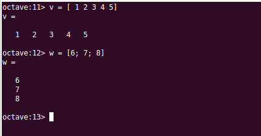

Vectores y Matrices
===================

.. contents::

.. toctree::
	matrices.rst

Vectores
--------

*Octave* trabaja con vectores de datos, tanto con vectores fila como con vectores columna.

Para definir un vector fila por teclado solo hay que teclear los elementos separados por un espacio o por una coma y encerrados entre corchetes.

Analogamente, un vector columna se define tecleando la lista de elementos separados por punto y coma '*;*' o por la pulsación de la tecla *intro*:

Rangos
------

En *Octave* podemos definir un tipo de datos especial, llamado **Rango**, consistente en una colección ordenada (una *serie*) de números equiespaciados.

Para definir un *rango* debemos indicar a *Octave* el valor inicial del rango, el incremento entre valores sucesivos y el máximo valor que pueden alcanzar los valores de la serie. La construcción para definir un *rango* coloca los tres valores separados por '**:**' :

.. code-block:: octave

	% rango = inicio : incremento : máximo_valor
	rango = 1:2:10 
	% El resultados será: 1 3 5 7 9

Cuando se omite el *incremento*, *Octave* asume que el incremento es la unidad:

.. code-block:: octave

	% rango = inicio : máximo_valor
	rango = 1:4 
	% El resultado será: 1 2 3 4

Se pueden establecer rangos de valores decrecientes. Para ello el valor de inicio deberá ser mayor que el valor final y el incremento un valor negativo:

.. code-block:: octave

	rango = 4:-1:0 
	% El resultado será: 4 3 2 1 0

Para especificar los valores inicio, incremento o máximo de un rango se pueden utilizar funciones, o cualquier otra expresión de *Octave* que devuelva un resultado válido, por ejemplo:

.. code-block:: octave

	rango = 0:intmax('uint8') 
	% El resultado serán los primeros 255 números naturales: rango = 0 1 2 ... 255
	rango2 = 0:2:2^3
	% El resultado será: rango2 = 0 2 4 6 8

Definición de vectores a partir de rangos
-----------------------------------------

Una de las utilizaciones de los *rangos* es la definición de las componentes de un vector. Veamos un ejemplo. Supongamos que queremos un vector denominado *az* cuyas componentes sean los ángulos *0, 90, 180, 270*. Podríamos definirlo de la siguiente manera:

.. code-block:: octave

	rango = 0:90:270 
	az = [rango]
	% El resultado será: az=[0 90 180 270]

De hecho, no es necesario definir primero el rango y luego el vector. La manera habitual de hacerlo es definiendo el rango directamente dentro de los corchetes:

.. code-block:: octave

	az = [0:90:270]
	% El resultado será: az=[0 90 180 270]

La función *linspace()*
-----------------------

La función **linspace()** es también muy útil para definir vectores. Devuelve un vector con *n* números equiespaciados entre unos números de inicio y final. Los argumentos que se le pasan a la función son el número de inicio de la serie, el número final de la serie y el número total de elementos que tendrá la serie:

.. code-block:: octave

	% v = linspace( inicio, fin, num_elementos)
	v = linspace(1,10,10)
	% El resultado será: v=[1 2 3 4 5 6 7 8 9 10]

La función *linspace()* permite también realizar series descendentes, y también podemos utilizar expresiones válidas de *Octave* para los parámetros:

.. code-block:: octave

	w = linspace(10,5,5)
	% El resultado será: w=[10 9 8 7 6]
	z = linspace(0,pi/2,4)
	% El resultado será: w=[0.00000 0.52360 1.04720 1.57080]
	

Lectura de las componentes de un vector
---------------------------------------

Cuando queramos referirnos a una componente concreta de un vector, utilizaremos el nombre del vector seguido del índice de la componente encerrado entre paréntesis. En *Octave*, el índice de la primera componente de un vector es el **1**. Veamos un ejemplo refiriéndonos al vector definido en el epígrafe anterior *az = [0 90 180 270]* :

.. code-block:: octave

	az(1) 
	% El resultado será: 0
	az(2)
	% El resultado será: 90
	az(4)
	% El resultado será: 270

*Octave* proporciona un *truco* para extraer la última componente de un vector, sin tener que explicitar el índice, y es utilizar la palabra **end**. En el ejemplo anterior es equivalente escribir *az(4)* que *az(end)*:

.. code-block:: octave

	az(4)
	% El resultado será: 270
	az(end)
	% El resultado será: 270

También podemos definir las componentes a extraer mediante un rango. En el siguiente ejemplo extraemos la segunda y tercera componente del vector *az*. El resultado de la operación es un vector de dos componentes, *[90 180]*, que se lo asignamos a un nuevo vector que hemos llamado *es*:

.. code-block:: octave

	es = az(2:3)
	% El resultado será: es=[90 180]

Otro ejemplo de extracción de un *rango* de componentes de un vector es el siguiente, en el que primeramente definimos un vector *v* y a continuación extraemos algunas de sus componentes a un nuevo vector *W*:

.. code-block:: octave

	v = [1:2:10] % Se define un vector y se asigna a la variable v
	% El resultado será: v=[1 3 5 7 9]
	w = v(1:2:5) % Se extráen ciertas componentes del vector v que se asignan a w
	% El resultado será: w=[1 5 9]

.. Note:: Es importante distinguir entre las sentencias utilizadas para definir un vector, que utilizan **corchetes [ ]**, y las utilizadas para extraer componentes de un vector, que utilizan el nombre del vector seguido de las componentes a extraer entre **paréntesis ( )**.
	
Concatenación de vectores
-------------------------

Podemos unir dos vectores, esto es, poner las componentes de un vector a continuación de las de otro para formar un único vector. Para ello se definen entre corchetes los elementos a concatenar separados por *coma* o por *espacio*. Veamos un ejemplo:

.. code-block:: octave

	a = [1 2 3];
	b = [4 5 6];
	c = [a b]
	% El resultado será: c = [1 2 3 4 5 6]

Podemos hacer otro tipo de concatenaciones, por ejemplo, concatenar un vector con un rango, o un número con un vector, o un vector con un número. De hecho, cundo definimos un vector tecleando sus componentes, lo que hacemos es concatenar varios números:

.. code-block:: octave

	a = [1 2 3];
	c = [a 5]
	% El resultado será: c = [1 2 3 5]
	d = [-5:0 a 4:5]
	% El resultado será: d = [-5 -4 -3 -2 -1 0 1 2 3 4 5]
	d = [-5 -4 -3 -2 -1 0 a 4 5]
	% El resultado será: d = [-5 -4 -3 -2 -1 0 1 2 3 4 5]

Se pueden concatenar de manera similar vectores columna. En este caso las distintas *subcomponentes* se separarán por punto y coma.

	
Funciones utilitarias para trabajar con vectores
------------------------------------------------

Hay varias funciones útiles a la hora de trabajar con vectores. Siendo *v* un vector:

* **length(v)** Devuelve el número de componentes del vector *v*
* **max(v), min(v)** Devuelve el valor máximo/mínimo de entre las componentes de *v*
* **sum(v), prod(v)** Devuelve la suma/producto de las componentes de *v*
* **norm(v)** Devuelve el módulo del vector *v*
* **dot(v, w)** Devuelve el producto escalar de los vectores *v* y *w* 
* **cross(v, w)** Devuelve el vector producto vectorial de *v* y *w* (Las dimensiones de *v* y *w* deben ser congruentes como máximo tres)
* **sort(v)** Devuelve un vector con las componentes de *v* ordenadas de menor a mayor

	

